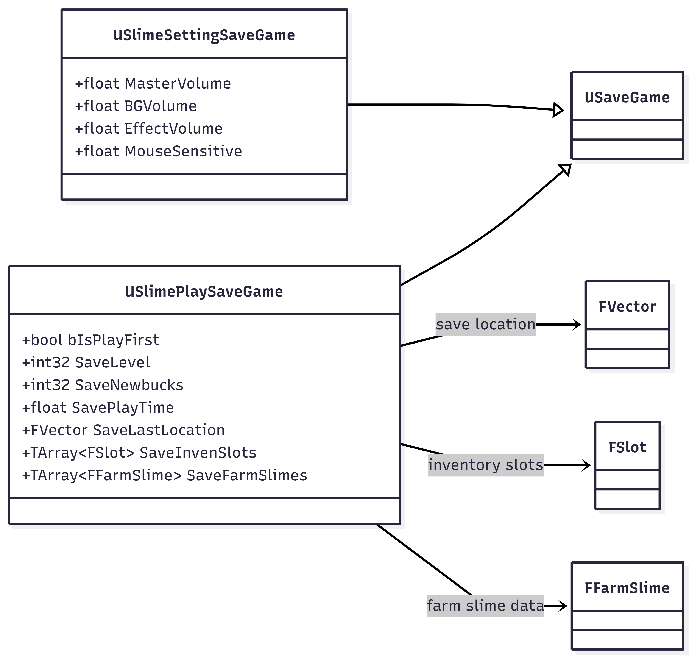
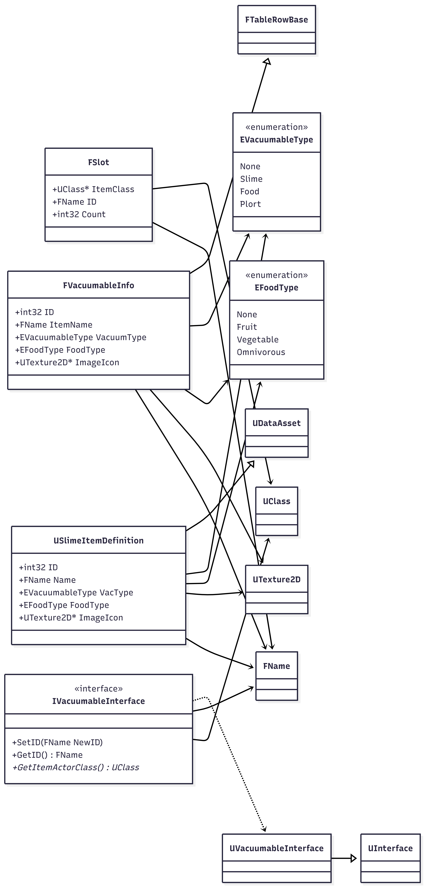
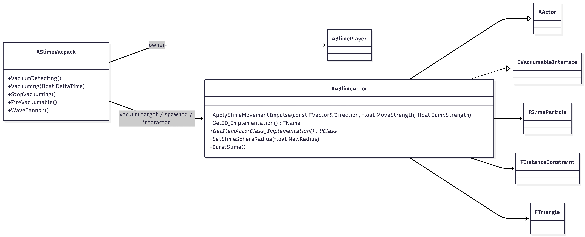

# 📌 말랑원정대

## 1. 프로젝트 개요

Slime Rancher 모작 프로젝트

- **장르 : Simulation / Action Adventure**
- **플랫폼** : PC
- **개발 기간** : 2026/02/09 ~ 2026/03/13 (31일)
- **참여 인원 및** : 2명
- **결과물 링크**:
    - GitHub :  [https://github.com/Imeamangryang/Expedition_Mallang](https://github.com/Imeamangryang/Expedition_Mallang)
    - 플레이 영상 / 빌드 링크 : [https://cafe.naver.com/rapavr/32189](https://cafe.naver.com/rapavr/32189)

---

## 2. 기획 목표

### 🔸기획 의도

**슬라임 시뮬레이션 게임**인 Slime Rancher 모작을 목표로 기획했다.

슬라임을 단순한 적 오브젝트가 아닌, **상호작용 가능한 시뮬레이션 대상**으로 다루는 것을 핵심 의도로 삼았다.

- 플레이어는 Vacpack을 이용해 슬라임이나 아이템을 흡입하고 관리할 수 있다.
- 수집한 자원은 인벤토리, 상점, 성장 요소와 연결된다.
- UI와 데이터 시스템을 통해 플레이어 상태 변화가 자연스럽게 게임 진행으로 이어지도록 구성했다.
- 슬라임은 일반적인 고정형 캐릭터가 아니라, 물리 기반 구조를 가진 오브젝트로 표현하여 프로젝트의 개성을 살리고자 했다.

### 🔸게임플레이 흐름

### **시나리오**

플레이어는 슬라임 세계에서 활동하며, 슬라임과 아이템을 수집하고 자원을 축적해 자신의 능력을 확장해 나간다.

탐색 과정에서 다양한 오브젝트와 상호작용하고, 획득한 자원을 바탕으로 상점을 이용하거나 플레이 상태를 성장시키며 게임을 진행한다.

### **캐릭터 조작 / 전투 / 상호작용**

- **이동 / 점프 / 시점 조작**을 통해 공간을 탐색
- **Vacpack 사용**으로 슬라임 및 오브젝트 흡입
- 흡입한 대상을 **발사(Fire)** 하거나 **WaveCannon** 기능 사용
- 숫자 키를 통해 **인벤토리 슬롯 선택**
- 상호작용 키를 통해 **NPC / 오브젝트 / 상점 시스템 연결**
- 플레이어 상태(HP, MP, Newbucks, Level, PlayTime)가 UI와 연동되어 즉시 반영

**탐색 → 수집 → 관리 → 활용 → 성장**구조로 반복된다.

### 🔸요구 시스템

프로젝트 구현을 위해 다음 시스템을 계획했다.

- **Player System**
    - 이동, 점프, 시점 전환, 상호작용, 장비 사용 처리
- **Vacpack System**
    - 흡입, 발사, 인벤토리 슬롯 관리
- **Slime Simulation System**
    - 슬라임의 물리 기반 형태 표현 및 상호작용 처리
- **UI System**
    - HP, MP, Newbucks, 슬롯, 상점, 사망 UI 표시
- **Shop System**
    - 자원 소모를 통한 플레이어 성장 및 스탯 변화 반영
- **Save System**
    - 플레이 진행 정보와 설정 정보 저장 / 로드
- **Data System**
    - 아이템, Vacuumable 정보, 슬롯 데이터, 확장 가능한 게임 데이터 관리
- **Interaction System**
    - NPC 및 월드 오브젝트와의 상호작용 처리

---

## 3. 프로젝트 아키텍처 설계 & 주요 구현 시스템

### **1. Player**

- `ASlimePlayer`는 플레이어의 이동, 점프, 상호작용, 진공기 사용 등 **게임플레이 입력과 상태**를 담당한다.
- `ASlimePlayerController`는 입력 매핑과 UI 생성/연결 등 **제어 흐름과 입력 시스템 관리**를 담당한다.
- `ASlimeVacpack`은 진공, 발사, 인벤토리 관리 등 **장비 로직**을 독립적으로 담당한다.

**플레이어 본체 / 플레이어 제어 / 장비 시스템**을 분리하여 각 클래스가 하나의 큰 책임에 집중하도록 구성했다.

### **2. UI와 게임 로직의 분리**

UI는 `UUserWidget` 기반 클래스로 분리되어 있으며, 실제 게임 로직과 직접 뒤섞이지 않도록 설계되어 있다.

- `USlimePlayerHUD`
- `USlimePlayerStatUI`
- `USlimePlayerSlotUI`
- `USlimeShopUI`
- `USlimeDeadUI`
- `UShopInfoUI`
- `UShopLVUI`

UI는 직접 게임 상태를 계산하기보다는, `SetUpSlimePlayer()`를 통해 플레이어와 연결된 뒤 **Delegate/Event를 통해 갱신**되는 구조를 사용한다.

이 구조의 장점은 다음과 같다.

- UI가 게임 로직을 직접 소유하지 않음
- UI 교체 및 Blueprint 확장이 쉬움
- 로직 수정 시 UI 클래스까지 크게 건드리지 않아도 됨
- Designer/기획자 친화적인 Blueprint 이벤트 기반 확장 가능

### **3. Delegate 기반 이벤트 드리븐 구조**

`ASlimePlayer.h`에는 다음과 같은 Delegate가 정의되어 있다.

- HP / MP / Newbucks 업데이트
- 아이템 정보 표시
- 슬롯 선택/변경
- 상호작용
- 상점 인터랙션
- 사망 UI
- 슬라임 농장 저장

즉 플레이어 상태가 변할 때, UI가 이를 polling 하지 않고 **이벤트가 발생했을 때만 반응**하도록 연결되어 있다.

결과적으로 프로젝트는 단순한 직접 호출 방식보다 **느슨한 결합(loose coupling)**을 위해 Delegate를 적극적으로 활용하는 구조를 가지고 있다.

이 방식은 다음에 유리하다.

- UI 추가/제거가 쉬움
- 상태 변경 로직 재사용 가능
- 디버깅 시 이벤트 흐름 추적이 비교적 명확
- 플레이어와 UI의 직접 의존도를 줄임

### **4. 데이터 중심 설계: Save / Item / Vacuumable 정보 분리**

- **저장 데이터 분리**
    - `USlimeSettingSaveGame`
    - `USlimePlaySaveGame`

설정 저장과 플레이 저장을 분리하여, **환경설정 데이터**와 **게임 진행 데이터**를 구분했다.

이 구조는 유지보수에 유리하다.

- 옵션 저장과 세이브 슬롯 저장의 책임 분리
- 기능 확장 시 충돌 감소
- 저장 포맷 관리가 쉬움

- **아이템/흡입 가능 정보 분리**
    - `FVacuumableInfo`
    - `FSlot`
    - `USlimeItemDefinition`

아이템/오브젝트 관련 정보는 클래스 내부에 하드코딩하기보다 **Struct/DataAsset/DataTable 기반 데이터 객체**로 분리되어 있다.

이 설계의 장점:

- 아이템 추가 시 코드 수정량 감소
- 밸런싱 데이터 수정이 쉬움
- 디자이너가 다루기 쉬운 데이터 중심 파이프라인 구성 가능

결과적으로 단순한 클래스 중심 설계뿐 아니라 **데이터 중심 설계(Data-Driven Design)** 요소도 함께 사용하고 있다.

### **5. Interface 기반 확장 구조**

인터페이스는 다음 기능을 규정한다.

- `SetID`
- `GetID`
- `GetItemActorClass`

그리고 `AASlimeActor`는 이 인터페이스를 구현한다.

진공팩에 의해 처리 가능한 객체를 특정 클래스에 묶지 않고 **“Vacuumable한 대상”이라는 공통 규약**으로 추상화했다.

이 구조는 확장에 매우 유리하다.

예를 들어 앞으로 아래 타입을 추가해도 구조를 유지할 수 있다.

- 슬라임 외의 흡입 가능한 아이템
- 음식 오브젝트
- 플롯(plort) 오브젝트
- 퀘스트 전용 수집 오브젝트

즉, 진공 시스템은 구체적인 클래스에 의존하기보다 **인터페이스 계약에 의존하는 방향**으로 설계되어 있다.

이는 OCP(Open-Closed Principle) 관점에서도 좋은 구조다.

- 기존 시스템 수정은 최소화
- 새로운 Vacuumable Actor만 추가 구현하면 됨

### 6. **시뮬레이션 로직의 독립성**

`AASlimeActor`는 단순히 엔진 내부에 포함된 피직스 시뮬레이션을 사용하는 것이 아니라, 내부에 슬라임 시뮬레이션을 위한 구조를 직접 포함하고 있다.

- `FSlimeParticle`
- `FDistanceConstraint`
- `FTriangle`
- XPBD 관련 계산 함수
- 충돌 / 부피 / 거리 제약 계산 함수

이 구조는 슬라임의 변형/물리 거동을 **독립적인 시뮬레이션**으로 취급하고 있음을 보여준다.

### 7. **확장 가능성 관점에서의 구조적 장점**

현재 프로젝트의 구조는 확장에 비교적 유리하다.

- 새로운 UI 추가
- 새로운 Vacuumable 오브젝트 추가
- 플레이어 장비 추가
- 세이브 데이터 확장
- 아이템 종류 추가
- 슬라임 타입 추가
- 상점 시스템 확장

그 이유는 다음과 같다.

- UI가 플레이어 상태와 느슨하게 결합됨
- 데이터 구조가 별도로 존재함
- 인터페이스 기반 대상 추상화가 있음
- SaveGame 객체가 분리되어 있음
- 장비 로직이 플레이어 본체에서 분리되어 있음

---

## 5. 문제 해결 및 기술 도전

### **🔸이슈 1 — 게임플레이/로직 이슈**

### **문제 상황**

플레이어는 이동, 상호작용, 진공기 사용, 인벤토리 관리, 상점 이용 등 여러 시스템을 동시에 사용한다.

초기 구조에서는 이 로직들이 플레이어 클래스에 과도하게 집중될 가능성이 있었고, UI와 장비, 상호작용 로직까지 한 클래스에 얽히면 유지보수가 어려워질 수 있었다.

### **원인**

- 플레이어 입력과 장비 로직이 강하게 결합될 가능성
- UI가 플레이어 상태를 직접 참조하면 의존성이 증가
- 상점/슬롯/사망 UI처럼 서로 다른 화면 로직이 한 흐름에 섞일 위험
- Vacuumable 대상 처리가 특정 클래스에 종속되면 기능 확장이 어려움

### **해결 과정**

- `ASlimePlayer`는 **플레이어 상태와 입력 처리**
- `ASlimeVacpack`은 **흡입/발사/인벤토리 관리**
- `ASlimePlayerController`는 **입력 매핑 및 UI 생성**
- 각 UI 위젯은 `SetUpSlimePlayer()`와 Delegate를 통해 **이벤트 기반 갱신**
- `IVacuumableInterface`를 도입하여 **흡입 가능한 대상의 공통 규약** 정의

게임플레이 로직을 **Player / Controller / Equipment / UI / Interface** 단위로 나누어 책임을 분리했다.

### **개선 결과**

- 기능 간 결합도가 낮아져 유지보수가 쉬워짐
- UI 교체 및 추가가 쉬워짐
- 새로운 Vacuumable 오브젝트를 추가할 때 기존 시스템 수정이 줄어듦
- 플레이어 로직이 과도하게 비대해지는 문제를 완화

### **🔸이슈 2 — 엔진/최적화 이슈**

### **문제 상황**

이 프로젝트는 슬라임 시뮬레이션, 플레이어 Tick, Vacpack Tick, 충돌 판정, UI 갱신 등 여러 실시간 로직을 포함한다.

특히 `AASlimeActor`의 XPBD 기반 계산, `ASlimeVacpack`의 감지/흡입 처리, 플레이어와 UI의 실시간 상태 갱신은 프레임 저하 가능성이 높은 구조다.

### **예상 원인**

- Actor별 `Tick()` 호출 증가
- 슬라임 시뮬레이션의 연속 계산 비용
- 진공 감지 범위 내 Actor 탐색 비용
- 충돌/오버랩 이벤트의 빈번한 호출

### **해결 과정**

- 슬라임 시뮬레이션은 Custom LOD 구조를 통해 **계산량 조절 가능성 확보**
- `AASlimeActor` 내부에서 파티클/제약 조건을 분리해 **시뮬레이션 단위를 구조화**

### **개선 결과**

- 시뮬레이션 계산을 구조적으로 분리해 최적화 포인트 확보
- 대량의 슬라임 시뮬레이션에서도 안정적인 FPS 확보
